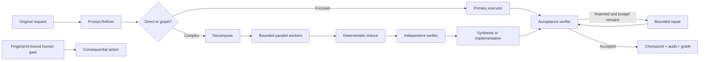

# Autonomous Graph Engineering

[](https://github.com/orperelman123/autonomous-graph-engineering/actions/workflows/ci.yml)
[](https://github.com/orperelman123/autonomous-graph-engineering/actions/workflows/codeql.yml)
[](LICENSE)

An open-source TypeScript system that improves prompts without changing intent, turns complex work into bounded execution graphs, runs Codex and Claude Code as isolated workers, verifies results, and gates consequential actions.

This project combines graph engineering and loop engineering:

- a directed acyclic graph handles decomposition, concurrency, deterministic reduction, cross-checking, and synthesis;
- a verifier-controlled repair loop is capped by explicit budgets;
- human gates and reconciliation records control external or ambiguous side effects.

It implements public agent-engineering patterns. It is not represented as OpenAI's or Anthropic's private internal system.

## Features

- Intent-preserving deterministic prompt compiler
- Optional OpenAI or Anthropic semantic refinement
- Direct routing for focused work and DAG routing for complex work
- Codex and Claude Code executors with isolated child context
- Global concurrency, fan-out, timeout, output, token, and repair budgets
- Output-schema enforcement and independent verification
- Append-only JSONL audit events
- Atomic fingerprinted checkpoints and crash-safe resume
- Fingerprint-bound human approvals
- CLI-only reconciliation for ambiguous side effects
- Artifact and repository semantic graders
- MCP, CLI, and authenticated loopback-first HTTP interfaces

## Quick start

Requirements:

- Node.js 20 or newer
- npm
- Optional: authenticated `codex` and/or `claude` CLIs for real model execution

```bash
git clone https://github.com/orperelman123/autonomous-graph-engineering.git
cd autonomous-graph-engineering
npm ci
npm run check
```

Run deterministic prompt refinement:

```bash
npx prompt-refiner refine "Audit this service and verify every finding"
```

Plan and run a read-only graph:

```bash
npx graph-engineer plan --force-graph "Audit every service and verify findings"
npx graph-engineer run --autonomy read_only --executor codex --verifier claude \
  "Read package.json and report the package name with evidence"
```

Install the CLIs and local plugin bundle:

```bash
npm run install:local
```

Then follow the [Codex and Claude Code installation guide](docs/installation.md).

## Architecture



See [Architecture](docs/architecture.md), [Installation](docs/installation.md), [Security model](docs/security-model.md), and [Interfaces](docs/interfaces.md).

## Repository layout

```text
packages/
  prompt-refiner/       Intent-preserving compiler, MCP, HTTP, and CLI
  graph-orchestrator/   Planner, validator, runtime, executors, checkpoints
plugins/prompt-refiner/ Portable Codex and Claude plugin sources
schemas/                Public JSON contracts
config/                 Safe example configuration and semantic corpus
docs/                   Architecture, security, interfaces, and evaluation
scripts/                Installer and repository validation tools
.github/                CI, CodeQL, Dependabot, and contribution templates
```

## Safety defaults

- Read-only is the default autonomy level.
- A human gate cannot elevate a graph's autonomy.
- MCP never accepts human-gate approval.
- HTTP approvals require authentication and a separate explicit flag.
- Non-loopback HTTP binding requires an API key.
- Interrupted side-effecting nodes are never replayed automatically.
- Node output is treated as data, never as orchestration instructions.

Review [SECURITY.md](SECURITY.md) before using write, external, or destructive permissions.

## Project status

The current suite contains 62 unit and interface tests, 20 adversarial graph cases, 27 prompt-refinement evaluations, and a two-case repository semantic corpus. See [Evaluation](docs/evaluation.md) for what those checks prove—and what they do not.

## Contributing

Read [CONTRIBUTING.md](CONTRIBUTING.md), [GOVERNANCE.md](GOVERNANCE.md), and the [Code of Conduct](CODE_OF_CONDUCT.md). Security reports should follow [SECURITY.md](SECURITY.md), not public issues.

## License

[MIT](LICENSE)
