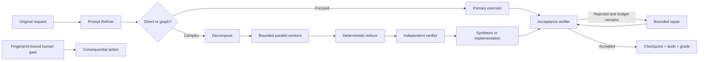

<div align="center">

# Autonomous Graph Engineering

**Turn a request into a bounded, verified execution graph—not an agent that loops forever.**

[Quick start](#quick-start) · [Why graphs?](docs/why-graphs.md) · [Evaluation](docs/evaluation.md) · [Roadmap](ROADMAP.md)

</div>

[](https://github.com/orperelman123/autonomous-graph-engineering/actions/workflows/ci.yml)
[](https://github.com/orperelman123/autonomous-graph-engineering/actions/workflows/codeql.yml)
[](https://github.com/orperelman123/autonomous-graph-engineering/releases)
[](https://github.com/orperelman123/autonomous-graph-engineering/stargazers)
[](LICENSE)

An open-source TypeScript runtime and plugin for Codex, Claude Code, Cursor, and GitHub Copilot. It preserves the user's original request, decomposes broad work into a validated DAG, runs isolated workers, cross-checks results, caps repair, and stops for human approval before consequential actions.

## The problem it solves

Agent loops are useful, but an unbounded loop can silently expand scope, repeat a side effect, burn tokens, or accept its own weak answer. Autonomous Graph Engineering makes the control plane explicit:

- the graph decides what may run, in what order, and with which permission;
- budgets bound nodes, concurrency, fan-out, time, tokens, and repair;
- an independent verifier controls a small repair loop;
- fingerprint-bound gates and reconciliation records protect side effects;
- checkpoints and JSONL events make every run inspectable.

This project implements public agent-engineering patterns. It is not represented as OpenAI's or Anthropic's private internal system.

## See it in 60 seconds

```bash
git clone https://github.com/orperelman123/autonomous-graph-engineering.git
cd autonomous-graph-engineering
npm ci
npm run doctor
npm run demo

# Preserve intent and compile a safer execution brief.
npx prompt-refiner refine "Review auth, keep scope fixed, and verify every claim"

# Build a bounded read-only DAG with independent verification.
npx graph-engineer plan --force-graph "Audit every service and verify findings"
```

The first command returns the original prompt hash, constraints, acceptance criteria, verification steps, and required permissions. The second returns a JSON graph with fixed budgets and the path `scope → investigate → reduce → cross-check → synthesize → acceptance`.

Run the credential-free [control-plane benchmark](docs/benchmark.md):

```bash
npm run benchmark
```

It verifies how direct execution, a bounded repair loop, and a validated graph behave when the same deterministic verifier rejects the first candidate. It does not claim to measure model intelligence, quality, cost, or speed.

## Features

- Intent-preserving deterministic prompt compiler
- Optional OpenAI or Anthropic semantic refinement
- Direct routing for focused work and DAG routing for complex work
- Codex and Claude Code executors with isolated child context
- Native Cursor plugin metadata and always-on refinement rule
- Native GitHub Copilot CLI plugin with deterministic prompt transformation
- Global concurrency, fan-out, timeout, output, token, and repair budgets
- Output-schema enforcement and independent verification
- Append-only JSONL audit events
- Atomic fingerprinted checkpoints and crash-safe resume
- Fingerprint-bound human approvals
- CLI-only reconciliation for ambiguous side effects
- Artifact and repository semantic graders
- MCP, CLI, and authenticated loopback-first HTTP interfaces
- Optional fail-closed external security provider with hashed inputs

## Graph engineering and loop engineering

They are complements, not competitors:

| Use a loop for | Use a graph for |
| --- | --- |
| Repeatedly improve one candidate | Decompose work with dependencies |
| Retry after verifier feedback | Run safe independent work concurrently |
| Stop after a small fixed number of rounds | Give each node an explicit permission and budget |
| Local convergence | Cross-check, synthesize, checkpoint, and audit a whole workflow |

This project places a **bounded repair loop inside a validated graph**. See [Why graphs, loops, and gates belong together](docs/why-graphs.md).

## Quick start

Requirements:

- Node.js 20 or newer
- npm
- Optional: authenticated `codex` and/or `claude` CLIs for real model execution

```bash
git clone https://github.com/orperelman123/autonomous-graph-engineering.git
cd autonomous-graph-engineering
npm ci
npm run check
```

Run deterministic prompt refinement:

```bash
npx prompt-refiner refine "Audit this service and verify every finding"
```

Plan and run a read-only graph:

```bash
npx graph-engineer plan --force-graph "Audit every service and verify findings"
npx graph-engineer run --autonomy read_only --executor codex --verifier claude \
  "Read package.json and report the package name with evidence"
```

Install the CLIs and local plugin bundle:

```bash
npm run install:local
```

Then follow the [four-host installation guide](docs/installation.md).

Prepare a native local bundle for Cursor or GitHub Copilot CLI:

```bash
npm run install:cursor
npm run install:copilot
```

Cursor uses an always-on rule because its current pre-submit hook can allow or
block a request but cannot replace it. GitHub Copilot CLI uses the
`userPromptTransformed` hook and therefore receives the deterministic improved
brief automatically. The same shared skills and MCP servers are packaged for
both hosts.

For Claude Code, the repository is also a plugin marketplace:

```text
/plugin marketplace add orperelman123/autonomous-graph-engineering
/plugin install prompt-refiner@autonomous-graph-engineering
```

The plugin installs the skills and safety hooks. Register the two MCP servers using the [installation guide](docs/installation.md) to expose executable prompt-refinement and graph tools.

## Architecture



See [Architecture](docs/architecture.md), [Installation](docs/installation.md), [Security model](docs/security-model.md), [External security provider](docs/external-security-provider.md), and [Interfaces](docs/interfaces.md).
Maintainers should also follow the evidence-gated [Release process](docs/releasing.md).

## Repository layout

```text
packages/
  prompt-refiner/       Intent-preserving compiler, MCP, HTTP, and CLI
  graph-orchestrator/   Planner, validator, runtime, executors, checkpoints
plugins/prompt-refiner/ Portable Codex, Claude, Cursor, and Copilot plugin sources
schemas/                Public JSON contracts
config/                 Safe example configuration and semantic corpus
docs/                   Architecture, security, interfaces, and evaluation
scripts/                Installer and repository validation tools
.github/                CI, CodeQL, Dependabot, and contribution templates
```

## Safety defaults

- Read-only is the default autonomy level.
- A human gate cannot elevate a graph's autonomy.
- MCP never accepts human-gate approval.
- HTTP approvals require authentication and a separate explicit flag.
- Non-loopback HTTP binding requires an API key.
- Interrupted side-effecting nodes are never replayed automatically.
- Node output is treated as data, never as orchestration instructions.

Review [SECURITY.md](SECURITY.md) before using write, external, or destructive permissions.

## Project status

The current suite contains 101 unit, interface, integration, launch-readiness, and schema-contract tests, 20 adversarial graph evaluations, 27 prompt-refinement evaluations, and a two-case repository semantic corpus. The checks are deterministic by default and do not require provider credentials. See [Evaluation](docs/evaluation.md) and the [benchmark methodology](docs/benchmark.md) for what they prove—and what they do not.

## Contributing

The project is young, so focused feedback has outsized value. Try the quick start, report the first confusing step, propose a real workflow, or follow one of the bounded [community contribution paths](docs/community-contributions.md).

Read the [roadmap](ROADMAP.md), [contributing guide](CONTRIBUTING.md), [governance](GOVERNANCE.md), and [support policy](SUPPORT.md). Security reports should follow [SECURITY.md](SECURITY.md), not public issues.

## License

[MIT](LICENSE)
