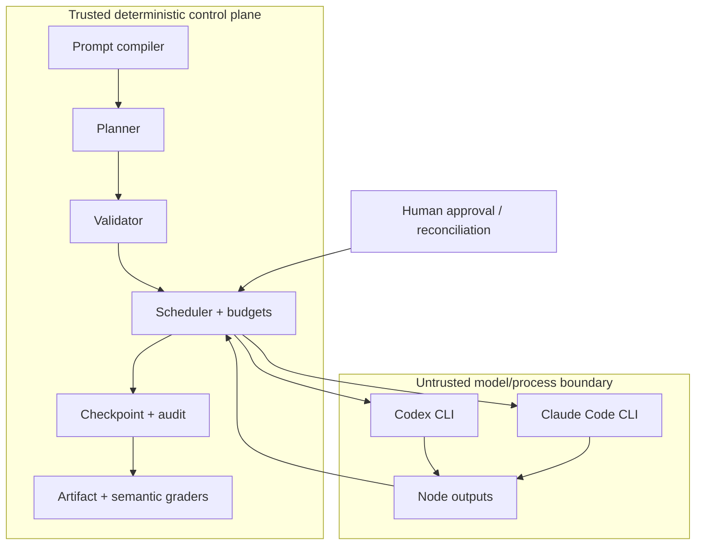

# Architecture

## Design goals

Autonomous Graph Engineering separates deterministic control from model reasoning. The runtime owns intent, scheduling, permissions, budgets, validation, persistence, and gates. Model executors receive bounded node inputs and return untrusted data.

The design favors:

- explicit contracts over prompt conventions;
- least privilege over implicit authority;
- bounded DAGs over open-ended self-prompting;
- independent verification over self-approval;
- append-only evidence and atomic checkpoints over hidden state;
- human reconciliation over guessing about ambiguous side effects.

## Components

### Prompt Refiner

`packages/prompt-refiner` preserves the original request and compiles a structured execution brief:

- objective, context, requirements, and constraints;
- acceptance criteria and verification;
- risk and action classification;
- permissions explicitly implied by the request;
- a hash of the exact original prompt.

The deterministic compiler is the default. Optional provider refinement may improve the brief but must pass local permission-preservation checks.

### Planner and validator

The graph planner routes focused tasks directly and broad tasks through decomposition, bounded parallel investigation, deterministic reduction, adversarial cross-checking, synthesis, and acceptance.

The validator rejects malformed shapes, cycles, missing dependencies, permission escalation, unsupported fields, excessive depth, concurrency, fan-out, token estimates, repair rounds, ungated consequential actions, side-effecting pre-gate ancestors, and unenforced concurrent writes.

### Runtime

The runtime schedules every ready node up to one global concurrency limit. Nested map workers share the same limiter. Deterministic nodes execute locally; agent and verifier nodes use registered executors.

Every non-plan run creates:

- `<run-id>.jsonl`: ordered append-only events;
- `<run-id>.checkpoint.json`: atomic graph, state, outputs, usage, and reconciliation data.

Resume reuses completed nodes. Interrupted read-only nodes may retry. Interrupted write, external, or destructive nodes require explicit operator reconciliation.
Generic verifier-driven repair is limited to non-side-effecting candidates.
Write, external, and destructive candidates require a new explicit run or
reconciliation because a timed-out executor may finish after its watchdog fires.

### Executors

Codex emits JSONL and Claude Code emits a JSON envelope. Adapters normalize outputs and usage without parsing unstable terminal prose.

Child processes:

- receive explicit sandbox or permission modes;
- omit unnecessary user plugins, MCP servers, and session persistence;
- have bounded output capture;
- receive abort signals and process-tree termination on timeout;
- cannot expand the graph's declared node permission.

### Verification and repair

Acceptance verifiers return a locally schema-validated `{accepted, reasons}` result. Rejected candidates may enter a capped repair loop. Repair retains the candidate's permission and output schema. External and destructive results cannot be replaced by generic repair.

### Gates and reconciliation

Approval tokens bind graph ID, graph fingerprint, and gate ID. Editing a graph invalidates approval. Resuming an unfinished checkpoint that already records a completed gate requires the caller to supply that gate's approval token again; checkpoint state alone is not treated as fresh approval.

When a side-effecting process ends ambiguously:

- `not_applied` records evidence that no effect occurred and permits retry;
- `completed` records verified output and continues without replay.

Reconciliation exists only on the human-operated CLI.

## Data flow and trust boundaries

See [Security model](security-model.md) for threat assumptions and residual risks.
