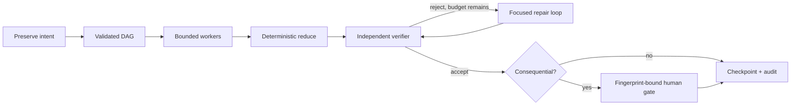

# Why graphs, loops, and gates belong together

Graph engineering does not replace loop engineering. It gives the loop a safe place to operate.

## The three control structures

### Graph

A directed acyclic graph defines dependencies, concurrency, permissions, budgets, and deterministic aggregation. It is best for work that must be decomposed, independently checked, or resumed.

### Loop

A loop lets a verifier reject a candidate and request a focused revision. It is best for local convergence when the repair target and stopping condition are explicit.

### Gate

A human gate is the boundary before an external, destructive, or otherwise consequential action. It binds approval to the exact graph fingerprint instead of asking an agent to decide whether it has permission.

## Why a loop alone is insufficient

An autonomous loop still needs answers to questions outside the loop:

- Which tasks may run concurrently?
- Which worker may write or call an external system?
- What is the total token and time budget?
- How is an interrupted side effect reconciled without blind replay?
- Can a resumed run prove that its graph was not changed?
- Who independently evaluates the final result?

The graph encodes those answers. The loop only improves a declared candidate.

## The runtime pattern

## Choosing the smallest mechanism

- Use direct execution for a focused, low-risk request.
- Add a bounded loop when one candidate needs verifier-controlled improvement.
- Use a graph when work has independent investigations, dependencies, cross-checks, or different permissions.
- Add a human gate only where the graph crosses into consequential action.

That combination is the core design of Autonomous Graph Engineering.
